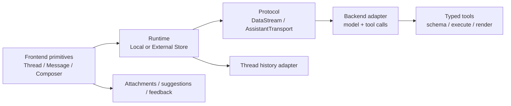
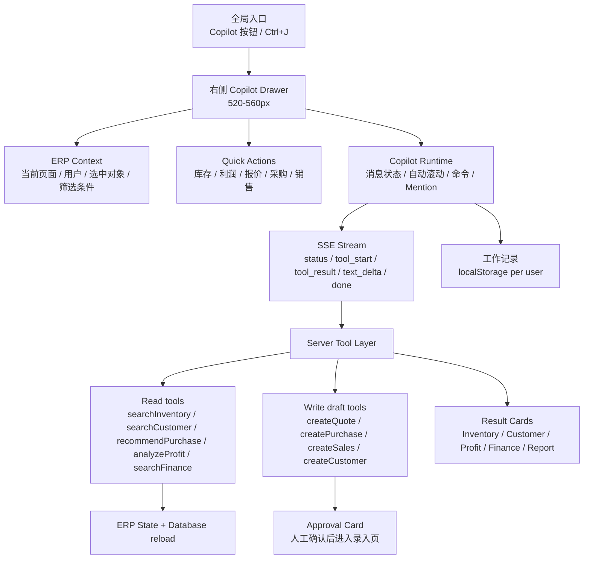

# OneERP AI Copilot（Phase 1）

## 1. assistant-ui 研究结论

assistant-ui 的核心不是一套固定聊天页面，而是把“消息渲染、运行时状态、传输协议、工具和持久化”拆成可替换层。前端原语读写 Runtime；Runtime 负责线程状态和 Composer；协议层负责消息/状态流；后端负责模型与工具执行；历史记录通过 adapter 持久化。

### 值得学习

- 用 Message Parts 渲染文本、文件、推理、来源和工具调用，避免把所有回复拼成一段 Markdown。
- Runtime 与 UI 解耦：本地 Runtime 适合原型，外部 Store/Transport 适合 ERP 的权限、审计和服务端状态。
- Tool schema、执行结果和工具 UI 一起设计；工具结果应该是结构化卡片，而不是模型描述一遍数据。
- Thread viewport 统一处理自动滚动、空状态、输入区和建议；错误、重试、运行中状态是消息协议的一部分。
- 线程历史、附件、反馈、语音等通过 adapter 接入，避免核心状态对象膨胀。

### 不直接照搬到 ERP 的部分

- 不引入 assistant-ui 的聊天 UI、品牌样式或完整依赖；OneERP 需要右侧工作抽屉、业务卡片和当前页面上下文。
- 不把 Thread 当作聊天记录中心；OneERP 保存的是“工作记录”（分析库存、经营日报、生成报价草稿）。
- 不允许模型直接写业务表。创建客户、报价、采购单、销售单在 Phase 1 只生成草稿并要求人工确认。
- 不把 provider 的消息协议暴露给浏览器。浏览器只消费 OneERP 自己的 SSE 事件，后端负责模型适配、权限和工具执行。

## 2. OneERP Copilot 架构

### UI 约定

- 抽屉宽度 `max-width: 560px`，首屏优先展示 Quick Actions；会话内容紧凑，不模拟 ChatGPT 全屏聊天。
- Header 只展示 OneERP Copilot、在线状态、当前页面、Token 控制、上下文同步、工作记录、清空和设置。
- 输入框为多行 textarea：Enter 发送，Shift+Enter 换行；支持 `/` 命令、`@` 客户、`#` 商品、粘贴/拖拽附件名称和 Ctrl+J 呼出。
- AI 消息支持轻量 Markdown、代码块、运行中/错误状态和 Tool Result Card；用户消息右对齐，AI 消息左对齐。
- 卡片动作可以跳转业务页面；写操作卡片显示“待确认”，不会静默提交。

## 3. Tool Layer（Phase 1）

所有工具定义位于 `src/utils/copilotTools.ts`，服务端在 `server/aiCopilot.ts` 执行。每个工具都有名称、说明、输入 schema、读写风险和结构化结果。

| Tool | 类型 | 作用 |
| --- | --- | --- |
| `searchInventory` | read | 库存、库龄、SN、成本、预估售价和风险 |
| `searchCustomer` | read | 客户、同行、供应商档案 |
| `analyzeProfit` | read | 今日/近 7 天/本月销售额、成本、毛利、毛利率 |
| `searchFinance` | read | 资金账户、应收、应付、结算流水 |
| `recommendPurchase` | read | 根据当前库存阈值给出补货建议 |
| `generateReport` | read | 库存、利润、资金经营日报摘要 |
| `createQuote` | write draft | 生成报价草稿，人工确认后进入报价页 |
| `createPurchase` | write draft | 生成采购单草稿，人工确认后进入采购开单 |
| `createSales` | write draft | 生成销售单草稿，人工确认后进入销售开单 |
| `createCustomer` | write draft | 生成客户档案草稿，人工确认后进入客户列表 |

服务端端点：`POST /api/ai/copilot`。它校验消息和上下文、重新加载数据库状态、执行工具并以 SSE 返回事件；配置 `AI_API_KEY`、`AI_BASE_URL`、`AI_MODEL` 时使用 OpenAI-compatible provider，否则使用本地规则工具，保证没有模型密钥时仍能工作。

## 4. 安全与后续

- Copilot 复用现有菜单权限；服务端使用 `requireAnyMenu`，不会因为前端隐藏按钮而绕过授权。
- 客户 Tool Card 可以在本地展示联系方式，但发给外部模型的工具结果会先去除电话、微信等个人字段。
- 查询工具只读；写工具只生成草稿。下一阶段可以增加带幂等键、审计日志和二次确认的 `confirmCopilotDraft`。
- 当前附件 Phase 1 只保留文件名并展示在输入框，后续接入媒体上传和文档解析。
- 当前 provider 的最终回答通过统一 SSE token stream 分片渲染；无模型密钥时由本地规则工具生成同一套事件。
