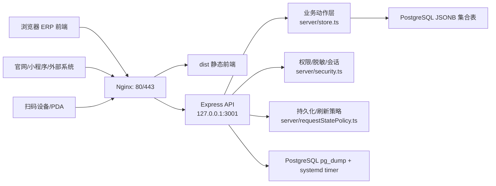
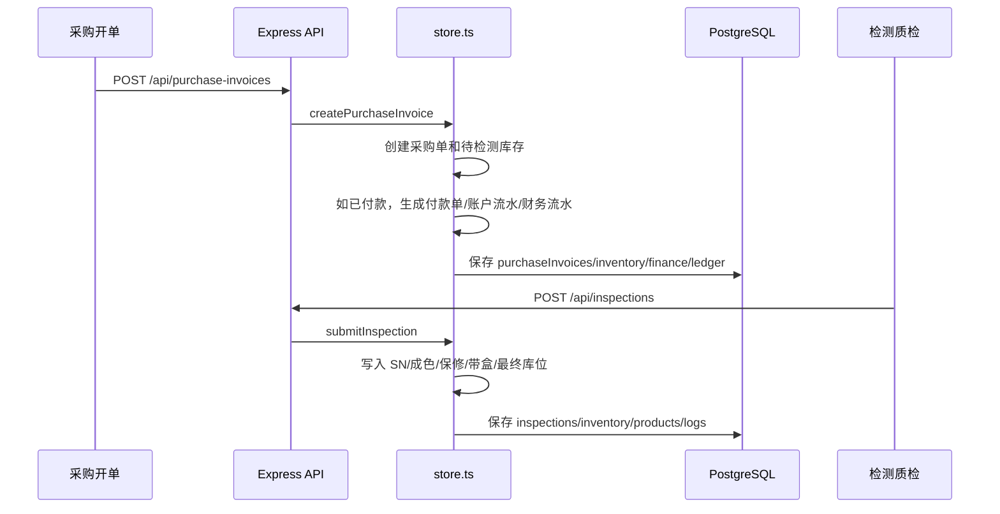
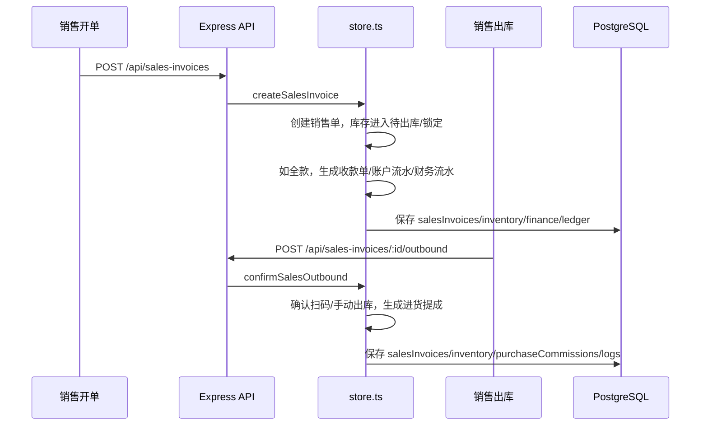
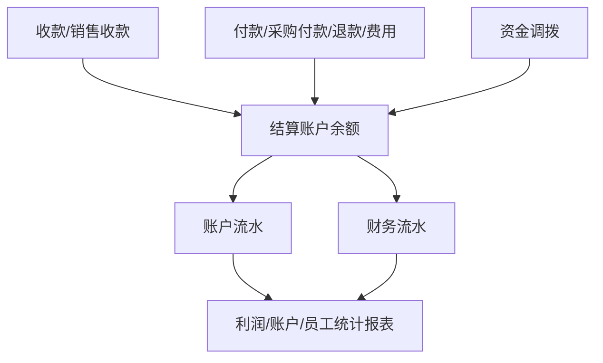
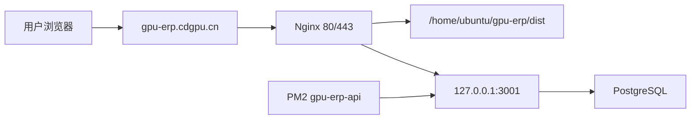

# 成都显卡一号店进销存 ERP 架构文档

本文档记录当前 ERP 的真实架构、模块边界、数据流和部署约定，方便后续维护、接入网站/小程序、排查性能问题和规划重构。

相关文档：

- [README.md](../README.md)：本地启动、PostgreSQL、构建命令和生产端口。
- [CRM_ARCHITECTURE.md](./CRM_ARCHITECTURE.md)：统一客户主体、迁移兼容和图片附件架构。
- [docs/PORTS.md](./PORTS.md)：服务器端口规划。
- [docs/OPEN_INVENTORY_API.md](./OPEN_INVENTORY_API.md)：开放库存 API 和外部价格同步接口。
- [docs/上线前测试报告.md](./上线前测试报告.md)：上线前测试记录。
- [docs/RELEASE_CHECKLIST.md](./RELEASE_CHECKLIST.md)：发布门禁、备份演练和上线后验收。

## 1. 系统定位

本系统是成都显卡一号店内部使用的显卡/配件进销存 ERP，核心目标是让门店能围绕单件库存、SN、采购、检测、销售、财务和客户关系形成可追溯链路。

当前业务主线：

- 商品库：维护显卡、CPU、主板、电源、显示器等商品模板。
- 采购回收：录入个人/同行来源、快递单、采购价、预计售价和付款信息。
- 检测质检：对待检测库存录入 SN、成色、保修、带盒、库位等入库属性。
- 单卡/SN库存：以每一件实物库存为核心管理状态、SN、库位、成本和销售关联。
- 销售管理：开销售单，进入销售出库池，仓库扫码/确认后完成出库。
- 退货管理：支持销售退货、进货退货和相关财务/库存回滚。
- 财务利润：结算账户、收付款、账户流水、财务流水、资金调拨、利润表、进货提成。
- 客户CRM：个人客户、同行档案、客户池、跟进与交易统计。
- 开放接口：为官网、小程序、扫码设备或外部价格系统提供库存和价格同步能力。

## 2. 技术栈

| 层级 | 技术 |
| --- | --- |
| 前端 | React 19、TypeScript、Vite、Tailwind CSS、lucide-react |
| 后端 | Node.js、Express、TypeScript、esbuild 构建 |
| 数据库 | PostgreSQL，业务数据按集合拆表保存 JSONB |
| 鉴权 | 网页登录会话 token，Open API 使用 `OPEN_API_TOKEN` |
| 部署 | Nginx 静态文件 + 反向代理 `/api` 到 PM2 管理的 API 进程 |
| 进程管理 | PM2，生产进程名 `gpu-erp-api` |
| 测试 | `tsx --test` + TypeScript `tsc --noEmit` |

## 3. 总体架构



生产访问路径：

- ERP 页面：`https://gpu-erp.cdgpu.cn/`
- 网页 API：`https://gpu-erp.cdgpu.cn/api/...`
- 开放 API：`https://gpu-erp.cdgpu.cn/api/open/...`

生产端口规则见 [docs/PORTS.md](./PORTS.md)。公网只暴露 Nginx 的 80/443，业务 API 固定绑定本机 `3001`。

## 4. 目录结构

Frontend V2 的真实入口和边界如下；本节是维护时的唯一前端目录参考。

```txt
src/
├── main.tsx                         # React 挂载入口
├── app/
│   ├── App.tsx                      # Provider 组合和 RouterProvider
│   ├── router.tsx                   # TanStack Router 路由树和懒加载页面
│   ├── providers.tsx                # Query、Toast 等全局 Provider
│   ├── auth/                        # AuthProvider、AuthBoundary、PermissionBoundary
│   └── shell/                       # AppShell、Sidebar、Header、WorkspaceTabs
├── components/
│   ├── ui/                          # shadcn/Base UI 基础组件，无业务逻辑
│   ├── common/                      # ERP 公共组件和 Dashboard 骨架
│   └── domain/                      # Account、Customer、Inventory 等领域选择器
├── features/                        # 按业务域拆分的页面、列定义、Schema、组件和测试
│   ├── dashboard/ inventory/ purchase/ sales/
│   ├── inspections/ returns/ finance/ crm/
│   ├── customers/ vendors/ products/ settings/
│   └── legacy/                      # 仅兼容入口，禁止新增依赖
├── services/api/
│   ├── client.ts                    # 统一鉴权、JSON、ApiError 和 401 处理
│   ├── endpoints/                   # 按资源封装 API 调用
│   ├── dto/                         # 服务端响应/请求 DTO
│   ├── adapters/                    # DTO → 前端 Domain Model
│   ├── query-keys/                  # 集中维护 TanStack Query Key
│   └── errors/                      # API 错误归一化
├── hooks/                           # 跨业务、无领域事实的 React Hooks
├── stores/                          # 纯 UI/会话偏好状态，禁止存业务快照
├── schemas/                         # 跨域 Schema；业务 Schema 放各 Feature
├── styles/                          # Design Tokens 和全局样式
├── types.ts                         # 历史状态快照兼容类型；禁止新业务直接导入
└── types/                           # 按域前端类型、DTO 适配后的 Domain Model
```

后端由 `server/index.ts` 组合应用，领域路由位于 `server/routes/`，业务事实与持久化分别由
`server/store.ts`、`server/db.ts`、`server/security.ts` 和 `server/requestStatePolicy.ts` 负责；前端架构调整不得把业务事实移入浏览器。

## 5. 前端架构

### 5.1 启动和页面生命周期

`src/main.tsx` 挂载 `src/app/App.tsx`。App 只组合全局 Provider，路由由
`src/app/router.tsx` 负责。每个业务页面由 TanStack Router 懒加载，并统一经过：

```text
AuthProvider → AuthBoundary → PermissionBoundary → AppShell → Feature Page
```

页面不得自行创建登录屏幕、替换 AppShell 或复制全局导航。离开未保存录入页时使用统一的 `useErpDirtyGuard`。

### 5.2 数据流和缓存边界

```text
FastAPI/Express Response
  → services/api DTO
  → Adapter
  → Feature Domain Model
  → Page / ERP Component
```

页面不得直接调用 `fetch`、解析原始 API 字段或读取 `/api/state?mode=full`；正式业务页只能消费领域 Endpoint 经 DTO/Adapter 投影后的 Domain Model。
TanStack Query 是服务端数据缓存；Zustand/本地状态只保存 UI 状态、临时上传状态和用户偏好。
Query Key 统一从 `src/services/api/query-keys/index.ts` 获取。

### 5.3 认证和权限

- `AuthProvider` 是唯一登录、注销、会话刷新和 `gpu-erp:auth-expired` 处理入口。
- `PermissionBoundary` 负责路由级菜单权限。
- 页面级动作和敏感字段通过统一 capabilities/policy helper 判断。
- UI 隐藏不是安全边界；服务端仍必须执行 401、403 和字段脱敏。

### 5.4 UI 和表格约定

- 基础视觉只从 `components/ui` 取；ERP 语义组件从 `components/common`、`components/domain` 取。
- 列表页统一使用 `ErpDataTable`，列定义、筛选 Schema、查询 Hook 保持在对应 Feature。
- URL 筛选通过 Router search schema 或统一 URL 状态 Hook；禁止页面直接拼接 `window.history`。
- 列显隐和密度通过统一 `useTablePreferences`，必须带版本和页面作用域。
- 组件展示页仅用于本地开发，不进入生产菜单。

正式页面的一级结构统一为：

```text
ErpPageFrame → ErpPageHeader（QuickStatus 保持在 Header 内）→ ErpPageToolbar（可选）→ ErpPageContent
```

列表筛选必须位于 `ErpPageToolbar`，业务主体必须位于 `ErpPageContent`。`DashboardShell` 仅保留为 `ErpDashboardPageFrame` 的兼容别名，架构检查不把它视为合法的新页面外壳；检测工作台是已登记的独立流程例外。

## 6. 后端架构

### 6.1 Express 入口

`server/index.ts` 只负责应用初始化、中间件顺序和领域路由挂载；新增路由必须进入
`server/routes/`，架构门禁限制主组合文件继续增长。当前 `system.ts`、`financeClosing.ts`
和 `domainSnapshots.ts` 已独立拥有各自的 HTTP 契约。

组合层负责：

- Express 应用初始化。
- `helmet` 安全响应头。
- 登录限流 `express-rate-limit`。
- Open API 限流。
- 网页 token 鉴权和菜单权限校验。
- 各业务路由挂载。
- 按权限脱敏返回前端状态。
- 变更请求先取得 PostgreSQL 会话级咨询锁，再完成“读库 → 业务校验 → 持久化”；该锁覆盖多个 PM2/Node 实例。

主要接口分组：

| 分组 | 示例接口 |
| --- | --- |
| 存活检查 | `GET /api/health`（不依赖数据库） |
| 就绪检查 | `GET /api/ready`（校验 PostgreSQL 状态初始化） |
| 登录会话 | `POST /api/auth/login`、`GET /api/auth/me`、`POST /api/auth/logout` |
| 全局状态 | `GET /api/state` |
| 商品库 | `/api/products`、`/api/products/import` |
| 采购 | `/api/purchase-invoices` |
| 检测 | `/api/inspections` |
| 库存 | `/api/inventory/summary`、`/api/inventory/scan-flow`、`/api/inventory/import` |
| 销售 | `/api/sales-invoices`、`/api/sales-invoices/:id/outbound` |
| 退货 | `/api/returns`、`/api/returns/:id/complete` |
| 客户/同行 | `/api/customers`、`/api/vendors` |
| CRM | `/api/gpu_erp/crm/...` |
| 财务 | `/api/gpu_erp/finance/...`、`/api/finance-ledger` |
| 行情 | `/api/market-quotes` |
| 备份 | `/api/backup` |
| 开放接口 | `/api/open/inventory/...`、`/api/open/prices/...` |

### 6.2 业务动作层

`server/store.ts` 是当前业务核心，负责：

- 创建、编辑、删除采购单和销售单。
- 库存入库、扫码出库、移库。
- 商品模板增删改、导入覆盖。
- 客户/同行交易统计。
- 结算账户余额、账户流水、财务流水。
- 收款、付款、资金调拨。
- 非经营收入/支出登记：使用 `paymentInRecords` / `paymentOutRecords` 保存分类、参考号和凭证图片，继续复用结算账户、账户流水和财务流水联动。
- 销售退货、采购退货。
- 售后处理。
- 组装拆卸。
- 进货提成。
- 操作日志。

开发约定：

- 涉及金额、库存状态、SN、账户余额、客户统计的规则都应该在这一层集中处理。
- 前端页面只传业务输入，不直接维护库存或账户余额。
- 删除类动作必须校验引用关系，例如：已入库采购单不能随意删除、有关联流水的结算账户不能删除。

### 6.3 请求持久化策略

`server/requestStatePolicy.ts` 定义每类请求需要保存和重载的集合。

例如：

- 采购开单影响：采购单、库存、客户/同行、财务流水、结算账户、付款单、日志。
- 销售开单影响：销售单、库存、客户、收款单、进货提成、财务和结算流水。
- 退货影响：退货单、库存、商品、原单据、客户/同行、财务流水、收付款记录、日志。

这个文件是避免“全表全量保存”和“前端刷新后才看到数据”的关键位置。新增 API 时必须同步维护。

### 6.4 命令执行器

`server/stateCommand.ts` 是变更路由的统一入口。路由只需提供：

1. 领域动作（调用 `store.ts`）；
2. 该动作产生的受影响记录补丁。

执行器负责将 `stateMerge` / `stateDelete` 转为数据库增量写入。采购、销售、库存和财务核心写入接口已迁移到此模式，避免在每个路由重复编写持久化样板代码。

## 7. 数据库与持久化

### 7.1 PostgreSQL 是主库

当前主数据源为 PostgreSQL。`data/app-state.json` 只作为历史导入来源，不再作为业务主库。

首次启动时，如果存在旧 JSON，可通过环境变量控制是否导入：

```bash
POSTGRES_IMPORT_LEGACY_JSON=false
```

### 7.2 数据表设计

当前采用“业务集合表 + JSONB 数据”的模式，每个集合一张表：

| 集合 | 表名 | 用途 |
| --- | --- | --- |
| `products` | `gpu_products` | 商品库模板 |
| `inventory` | `gpu_inventory` | 单卡/SN库存 |
| `inspections` | `gpu_inspections` | 检测记录 |
| `purchaseInvoices` | `gpu_purchase_invoices` | 采购/回收单 |
| `salesInvoices` | `gpu_sales_invoices` | 销售单 |
| `purchaseCommissions` | `gpu_purchase_commissions` | 进货提成 |
| `marketQuotes` | `gpu_market_quotes` | 行情参考 |
| `customers` | `gpu_customers` | 个人客户 |
| `vendors` | `gpu_vendors` | 同行档案 |
| `financeLedger` | `gpu_finance_ledger` | 财务流水 |
| `settlementAccounts` | `gpu_settlement_accounts` | 结算账户 |
| `settlementLedger` | `gpu_settlement_ledger` | 账户流水 |
| `paymentInRecords` | `gpu_payment_in_records` | 收款单 |
| `paymentOutRecords` | `gpu_payment_out_records` | 付款单 |
| `accountTransfers` | `gpu_account_transfers` | 资金调拨 |
| `assemblyOperations` | `gpu_assembly_operations` | 组装拆卸 |
| `returnOrders` | `gpu_return_orders` | 退货单 |
| `systemUsers` | `gpu_system_users` | 系统账号 |
| `sessions` | `gpu_sessions` | 网页 Bearer 会话（仅保存 token 哈希） |

每张集合表通常包含：

```sql
id text primary key,
data jsonb not null,
updated_at timestamptz not null
```

表和字段注释由 `server/db.ts` 初始化时写入数据库。

高频查询仍保留 JSONB 作为权威业务文档，`operational-projections-v1` 迁移为库存、采购、销售、财务和退货增加不可漂移的 PostgreSQL 生成列及组合索引。`GET /api/inventory/items` 与 Open API 库存列表直接使用这些投影字段分页和过滤，不再先把全部库存加载进 Node 进程；旧表达式索引暂时保留以支持版本回滚。

### 7.3 保存策略

当前持久化方式包含：

- `saveStateCollections`：保存受影响集合。
- `saveStateRecords`：增量保存/删除指定记录。
- `bulkUpsertRows`：批量 upsert，避免逐行 SQL 导致提交变慢。
- `appendOnlyCollection`：日志等追加型集合只写新增记录。
- `stateRevision`：每次业务变更递增，用于多实例缓存失效。
- PostgreSQL 会话级咨询锁：跨实例串行化读、校验和写入，防止并发写入基于同一份旧余额或旧库存计算。

开发注意：

- 不要新增“整库覆盖”式写入。
- 新功能优先使用明确集合增量保存。
- 删除动作要把数据库中被移除的记录同步删除，不能只删前端内存。

## 8. 权限与安全

### 8.1 网页登录权限

系统账号存在 `gpu_system_users`，返回前端前会脱敏密码哈希。网页 Bearer 会话保存在 `gpu_sessions`，仅持久化 SHA-256 token 哈希，因此 API 重启和多实例部署不会让已登录会话失效。

权限由两部分组成：

- 角色默认权限：`src/data/systemDefaults.ts`
- 账号权限覆盖：系统账号中的 `permissionOverrides`

菜单权限通过 `allowedMenus` 控制，菜单配置在 `src/utils/menu.ts`。

### 8.2 状态脱敏

`server/security.ts` 负责对不同权限用户返回不同状态：

- 无成本权限时隐藏采购成本、毛利、提成金额。
- 无财务权限时隐藏财务流水或结算账户余额。
- 无员工管理权限时只返回当前账号信息。

### 8.3 Open API 鉴权

开放接口不使用网页登录会话，统一使用 `OPEN_API_TOKEN`。

请求头二选一：

```http
Authorization: Bearer <OPEN_API_TOKEN>
X-API-Token: <OPEN_API_TOKEN>
```

开放接口已配置独立限流，详见 [OPEN_INVENTORY_API.md](./OPEN_INVENTORY_API.md)。

## 9. 关键业务数据流

### 9.1 采购到入库



规则：

- 采购阶段记录来源、成本、付款账户和快递单号。
- 显卡 SN 在检测质检阶段录入。
- 其他配件也必须检测后才入库。
- 最终库位以检测质检提交为准。

### 9.2 销售到出库



规则：

- 销售录单阶段主要选择型号和价格。
- 最终 SN 由销售出库环节扫码或手动确认。
- 已售出库存默认不在单卡库存中展示。

### 9.3 财务结算



规则：

- 每笔收款、付款、退款、费用、调拨都必须绑定结算账户。
- 账户余额允许为负数。
- 账户流水用于账户余额追溯。
- 财务流水用于经营报表和利润分析。
- 资金调拨必须生成独立调拨单据。
- 非经营收入分类包括赔偿、返点、配件销售、利息和其他收入；非经营支出分类包括员工、运费、办公、罚款、差旅和其他支出。它们不能绑定销售/采购业务单据，外部单号使用 `referenceNo` 保存。
- 非经营收支凭证通过 `gpu_media_assets` / `gpu_media_relations` 持久化，业务记录仅保存媒体 URL；删除或编辑仍由结算账户领域动作反向修正余额和两套流水。

### 9.4 退货

销售退货：

- 生成销售退货单。
- 库存回到待检测状态。
- 需要联动退款、客户成交统计、原销售单和财务流水。

采购退货：

- 生成进货退货单。
- 支持退款或抵扣账款。
- 需要联动库存、采购单、同行/客户往来和财务流水。

## 10. 开放 API 与外部系统

开放 API 面向：

- 官网库存展示。
- 小程序库存查询。
- 扫码设备/PDA。
- 外部价格系统。

当前开放能力：

- 查询库存列表。
- 按库存 ID 查询。
- 按 SN 查询。
- 查询整体库存汇总。
- 同步预计出货价。
- 扫码入库。
- 扫码出库。
- 扫码移库。

详细接口见 [OPEN_INVENTORY_API.md](./OPEN_INVENTORY_API.md)。

对接原则：

- 网站/小程序不要直连数据库。
- 外部系统只走 `/api/open/...`。
- 对外只暴露必要字段，避免暴露成本、账户、员工权限等内部数据。
- 价格同步接口只更新预计出货价，回收参考价仍由 ERP 行情参考人工/导入维护。

## 11. 部署架构

### 11.1 生产部署



生产目录：

```txt
/home/ubuntu/gpu-erp
├── dist/
├── server-dist/
├── data/
├── package.json
└── ecosystem.config.cjs
```

生产 PM2：

```txt
process: gpu-erp-api
mode: fork
API_PORT: 3001
```

预发布使用 `ecosystem.staging.config.cjs` 和独立的 `gpu-erp-api-staging`
进程。生产与预发布都必须通过 `npm run start:api` 启动 bundle；不要让 PM2
直接执行 `server-dist/index.mjs`，否则 PM2 的包装入口可能让服务进程保持在线但
没有建立 HTTP 监听。

### 11.2 部署命令约定

本地构建：

```bash
npm run lint
npm test
npm run build
```

常用同步排除：

```bash
rsync -az --no-perms --delete-delay \
  --exclude node_modules \
  --exclude .git \
  --exclude .env \
  --exclude '/data/***' \
  --exclude '/dist/***' \
  --exclude '/server-dist/***' \
  ./ ubuntu@1.14.64.60:/home/ubuntu/gpu-erp/
```

注意：`/data/***` 必须带前导 `/`，避免误排除 `src/data/`。

服务器构建与重启：

```bash
cd /home/ubuntu/gpu-erp
npm run build
npm prune --omit=dev
pm2 startOrRestart ecosystem.config.cjs --only gpu-erp-api --update-env
pm2 save
sudo nginx -t
sudo systemctl reload nginx
curl -fsS http://127.0.0.1:3001/api/health
curl -fsS http://127.0.0.1:3001/api/ready
```

### 11.3 上线检查

上线后至少检查：

```bash
curl -fsSI https://gpu-erp.cdgpu.cn/
curl -fsS https://gpu-erp.cdgpu.cn/api/health
curl -fsS https://gpu-erp.cdgpu.cn/api/ready
pm2 jlist
sudo nginx -t
```

要求：

- 首页 HTTP 状态 200。
- `/api/health` 返回 `ok: true`；`/api/ready` 返回 `ok: true` 和状态版本。
- PM2 只有一个 `gpu-erp-api` 实例，且为 `fork_mode`。
- Nginx 配置校验成功。

## 12. 备份与恢复

当前备份方式：

- 系统内可通过备份接口创建手动业务快照，用于人工核对和迁移。
- `scripts/pg_backup.sh` 生成 PostgreSQL custom dump；生产由
  `ops/systemd/gpu-erp-backup.timer` 每日 03:20（Asia/Shanghai）触发。
- systemd 通过 `/usr/bin/bash` 调用备份脚本，避免 `rsync --no-perms` 环境下的
  文件执行位差异让定时任务失效。
- `scripts/pg_restore_drill.sh` 只允许在显式确认的隔离数据库执行恢复演练。

建议生产备份策略：

- 每日自动 `pg_dump`，默认保留 30 天，可由 `BACKUP_RETENTION_DAYS` 调整。
- 备份目录应放在应用目录之外，并纳入异地/对象存储同步。
- 部署前创建一次手动备份。
- 重大导入前创建一次手动备份。

恢复原则：

- 优先恢复 PostgreSQL。
- 不建议直接用旧 `data/app-state.json` 覆盖线上业务。
- 恢复后必须重启 PM2，让内存态重新从数据库加载。

## 13. 开发约定

### 13.1 新增业务功能

新增涉及业务状态的功能时，至少检查：

1. 新增业务类型优先放在对应 `src/types/*.ts` 域文件；只有 `state.adapter.ts` 可以读取 `src/types.ts` 中尚未投影的历史集合类型。
2. `server/store.ts` 是否集中处理业务规则。
3. `server/index.ts` 是否新增/复用 API。
4. `server/requestStatePolicy.ts` 是否配置持久化集合。
5. `server/db.ts` 是否需要新增集合表。
6. `src/services/api/endpoints`、DTO 和 Adapter 是否需要新增资源边界；页面禁止直接 fetch。
7. `src/utils/menu.ts` 是否需要新增菜单和权限入口。
8. 测试是否覆盖金额、库存、SN、删除、退货或权限边界。

### 13.2 新增表格页面

优先复用：

- `DataTable`
- `useTablePreferences`
- 对应 Feature 的 filters / columns / Query Key
- CSV 导出工具 `csv.ts`

不要每个页面重复实现分页、筛选、导出、横向滚动、URL 同步和列隐藏。

### 13.3 架构迁移约束

- 新页面使用 `useAuth` / `useCapabilities`，不得创建页面级登录表单或重复请求 auth session。
- URL 筛选使用 `useUrlSearchState` 或 TanStack Router search schema，不直接调用 `window.history.replaceState`。
- 表格偏好使用 `useTablePreferences`，键名必须包含 Feature 和账号作用域，并带版本号。
- `/api/state?mode=full` 对正式 V2 前端是禁止边界；只有登录/首页可通过 `fetchInitialStateCompat` 读取裁剪后的 `mode=initial`，其余读取必须登记在 [API_READ_MIGRATION.md](./API_READ_MIGRATION.md) 的领域接口中。
- `src/features/legacy` 和 `src/data/demoData.ts` 仅供兼容/演示，生产页面不得新增依赖。

### 13.4 新增导入功能

优先复用：

- `csvImport.ts`
- `productImportUtils.ts`
- 统一导出文件名工具 `withStoreDownloadFilename`

导入必须明确：

- 唯一键是什么。
- 命中已有数据时是覆盖、跳过还是新建副本。
- 空备注是否写为“无备注”。
- 是否需要导入前确认覆盖数量。

### 13.5 新增外部接口

开放给网站/小程序/第三方的接口应放在 `/api/open/...` 下，并遵守：

- 使用 `OPEN_API_TOKEN`。
- 有限流。
- 不返回内部成本、账户余额、员工权限等敏感信息。
- 文档同步更新 [OPEN_INVENTORY_API.md](./OPEN_INVENTORY_API.md)。

## 14. 当前架构风险与后续方向

以下不是立即问题，但后续规模变大时需要继续推进：

1. **状态集合仍较大**  
   前端已经做懒加载和减少全量刷新，但长期应逐步改为后端分页、搜索和统计接口。

2. **JSONB 集合表已增加生成列，但聚合查询仍需继续关系化**  
   `operational-projections-v1` 已覆盖 SN、商品 ID、客户/供应商 ID、单据日期、库存/收付款/出库状态和关联单号；下一阶段应将财务汇总、单据分页和报表聚合直接下沉到 SQL，而不是继续扩大全量领域快照。

3. **业务逻辑仍集中在 `server/store.ts`**  
   当前利于统一口径，但文件会继续变大。后续可按采购、销售、库存、财务、客户拆 service。

4. **统计口径需要继续后端化**  
   首页、客户等级、利润、库存价值等应逐步变成后端汇总接口或汇总表，避免前端全量计算。

5. **会话已持久化并具备有界清理，未来高并发可再引入专用存储**
   `gpu_sessions` 只保存 token 哈希，支持 PM2 重启和多实例共享；登录与会话读取会按 `SESSION_CLEANUP_INTERVAL_MS` 节流执行一次批量过期清理，维护失败不会阻断正常鉴权。只有扩展到高并发、多地域部署时才需要评估 Redis。

6. **网站和小程序应复用 Open API**  
   不建议复制 ERP 业务逻辑到网站或小程序后端。网站/小程序应作为 API 消费方。

## 15. 快速排查入口

| 问题 | 优先查看 |
| --- | --- |
| 页面没有权限/菜单不显示 | `src/config/navigation.ts`、`src/utils/menu.ts`、`src/app/auth/PermissionBoundary.tsx`、`server/security.ts` |
| 登录失败/保持登录异常 | `src/app/auth/AuthProvider.tsx`、`src/services/api/client.ts`、`server/security.ts` |
| 提交后页面不更新 | `server/requestStatePolicy.ts`、`src/services/api/invalidation.ts` |
| 库存/SN 错误 | `server/store.ts`、`src/types/core.ts`、`src/types/inventory.ts` |
| 金额/账户余额错误 | `server/store.ts` 中财务/结算相关动作 |
| 导入/导出异常 | `src/utils/csvImport.ts`、`src/utils/csv.ts`、对应页面 import utils |
| 性能卡顿 | 是否全量渲染、是否前端全量筛选、是否 API 返回全量 state |
| 服务器 500 | `pm2 logs gpu-erp-api`、`sudo tail -n 80 /var/log/nginx/error.log` |
| 请求量/错误率/延迟 | 老板账号访问 `GET /api/ops/metrics`；指标只保留归一化路由，不含查询值、账号或 token |
| 静态页面权限问题 | `/home/ubuntu/gpu-erp` 和 `dist` 文件权限 |
